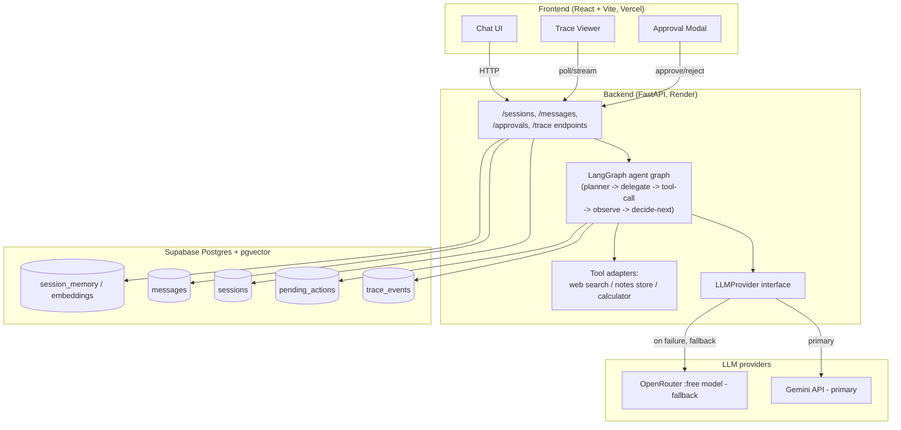

# Architecture — Agent Ops

Agent Ops is a multi-agent orchestration copilot: a planner agent decomposes
an incoming task into steps, delegates each step to a tool-using sub-agent,
and pauses for human approval before any irreversible action executes. Every
decision, tool call, and its reasoning is persisted and rendered in a trace
viewer — the trace *is* the product, not a debugging afterthought.

This document describes the system as designed on Day 1. It will be amended,
not rewritten, as later days add real code — if an amendment changes a
decision recorded in `ADR.md`, that gets a new ADR entry, not a silent edit
here.

## 1. System overview

## 2. Component responsibilities

**Frontend (`frontend/`)** — React + TypeScript + Vite + Tailwind. Renders
the chat, a trace panel showing each agent decision and tool call as it
happens (not just the final answer — this is the project's differentiator,
per the brief), an approval modal that blocks on a real pending action, and a
session list. Talks to the backend only over the documented REST API; holds
no LLM keys and no direct DB connection.

**Backend (`backend/`)** — FastAPI. Owns the LangGraph agent graph, the
provider failover, tool adapters, the approval state machine, and all
Supabase access (service-role key never leaves the backend). Exposes:
session CRUD, message send, approve/reject, and trace fetch endpoints (built
out Day 3).

**Agent graph** — a LangGraph state graph with (at minimum) these node
types, built Day 2:

- **planner** — decomposes the incoming task into an ordered/branching list
  of steps.
- **delegate** — routes a step to the sub-agent responsible for it (web
  search / notes store / calculator, initially — more tools can be added
  without changing this shape).
- **tool-call** — invokes the concrete tool adapter; catches and logs every
  failure (network error, malformed args, tool-side error) rather than
  letting an exception cross the graph boundary silently.
- **observe** — folds the tool's result (or failure) back into graph state.
- **decide-next** — given the updated state, decides whether to proceed to
  the next planned step, re-plan (if a step failed in a way that changes the
  plan), retry (if the failure looks transient), or request human approval
  before an irreversible step.

Every node transition writes a trace event: which node ran, what it decided,
which tool (if any) it called, what came back, and why it chose the next
node. This is the raw material the Day 4 trace viewer renders.

**LLMProvider interface** — one abstract interface (`generate(messages,
tools) -> response`) with two concrete implementations (`GeminiProvider`,
`OpenRouterProvider`, see ADR-002) and a `FailoverProvider` that composes
them: try Gemini, and on a timeout/5xx/rate-limit, transparently retry on
OpenRouter, logging the failover itself as a trace event. The planner graph
depends only on the interface, never on a concrete provider — swapping or
adding a third provider later touches one file.

**Tools (Day 2 minimum set)**

1. **Web search** — external information lookup.
2. **Notes / document store** — read/write persistent notes scoped to a
   session (backed by Supabase; this is also where embeddings/pgvector would
   be used if a step needs semantic recall over prior notes).
3. **Calculator / code-exec** — deterministic computation, kept separate from
   the LLM's own arithmetic to avoid the well-known failure mode of language
   models silently getting arithmetic wrong.

Each tool adapter has a uniform interface (`name`, `description`,
`args_schema`, `run`) so the planner's tool-selection logic doesn't special-
case any one tool, and each adapter's failure path is exercised by a test
(Day 2 requirement: at least one shown failure mode per feature area).

**Approval state machine (Day 3)** — a real state machine, not a UI-only
gate: `pending -> approved -> executed` or `pending -> rejected` (terminal).
Persisted in Supabase (`pending_actions` table) so a pending approval
survives a backend restart or a page reload — the frontend's approval modal
is a view onto this state, not the source of truth for it.

**Trace log (Day 3)** — append-only `trace_events` table: one row per agent
decision or tool call, with session id, node name, input, output/error,
reasoning text, timestamp, and provider used (Gemini vs. OpenRouter, so a
failover is visible in the trace itself).

**Memory (Day 3)** — `session_memory` table (plus pgvector embeddings column
for any semantic recall the agents need across a long session or across
sessions). Distinct from the trace log: memory is what the agent is allowed
to *use* as context; the trace log is a record of what it *did*, kept even
for context that later gets pruned from the active memory window.

## 3. Data flow — one step, happy path

1. User sends a message via `POST /sessions/{id}/messages`.
2. Backend loads session memory + trace context, invokes the LangGraph graph.
3. **planner** node decomposes the task (or continues an existing plan).
4. **delegate** picks the tool for the current step.
5. If the step is irreversible (e.g. a write that can't be undone), the graph
   transitions to a `pending` approval row instead of calling the tool, and
   returns to the frontend with an `awaiting_approval` status. Execution
   pauses here — literally, the graph run ends and is resumed later by a
   separate `POST /approvals/{id}/approve` call, not held open in memory.
6. **tool-call** invokes the tool adapter through the `LLMProvider`-agnostic
   tool interface (tools may or may not use the LLM themselves).
7. **observe** records the result (or failure) into state and the trace log.
8. **decide-next** picks the next node: another step, re-plan, retry, or
   done.
9. Every node's decision is written to `trace_events` as it happens, so the
   frontend's trace viewer can show progress live rather than only after the
   whole run completes.

## 4. Data flow — failure path (Gemini outage)

1. **tool-call** or **planner** node calls `LLMProvider.generate(...)`.
2. `FailoverProvider` calls Gemini; Gemini times out / returns 429 / 5xx.
3. Failure is logged as its own trace event (`provider_failover`,
   `from=gemini`, `to=openrouter`, reason).
4. `FailoverProvider` retries the same request against the pinned OpenRouter
   `:free` model.
5. If OpenRouter also fails, the error surfaces to **decide-next**, which
   either retries the whole step once (transient-looking failure) or
   re-plans (the step itself looks wrong, not just the provider call) —
   never silently drops the step. This exact path (mocked Gemini failure ->
   OpenRouter call observed, plus the retry/re-plan branch) is Day 2's
   required test, not just a design intention.

## 5. Deployment topology

- **Backend** → Render free web service, auto-deploy on push to `main`,
  Dockerized (Day 6). Cold-starts after 15 minutes idle (~30-60s first
  request) — expected and documented, not a bug.
- **Frontend** → Vercel Hobby, auto-deploy on push to `main`, connected to
  the same GitHub repo.
- **Database** → Supabase Postgres (pgvector enabled). Free project pauses
  after 7 days of total inactivity; README documents how to wake it.
- **CI** → GitHub Actions on every push: lint (ruff/eslint) + test
  (pytest/vitest) + build, required to pass before merge to `main` via
  branch protection (added Day 6).

## 6. Cross-cutting concerns (owned from Day 1, expanded through the week)

- **Every tool failure is caught and logged, never silently swallowed**
  (Day 2 hard requirement) — enforced at the tool-adapter boundary, not
  hoped for at the call site.
- **Human approval is a real state machine**, persisted server-side
  (Day 3), so the UI cannot fake an approval by just hiding a modal.
- **Rate limiting / per-session tool-call caps** (Day 5) exist specifically
  so a mis-planned agent loop cannot burn a full day's 50-request OpenRouter
  budget or an unknown Gemini free quota in one runaway session.
- **Secrets** never enter the frontend bundle or a committed file — only
  `backend/` reads `GEMINI_API_KEY` / `OPENROUTER_API_KEY` /
  `SUPABASE_SERVICE_KEY`; the frontend only ever talks to our own backend.
