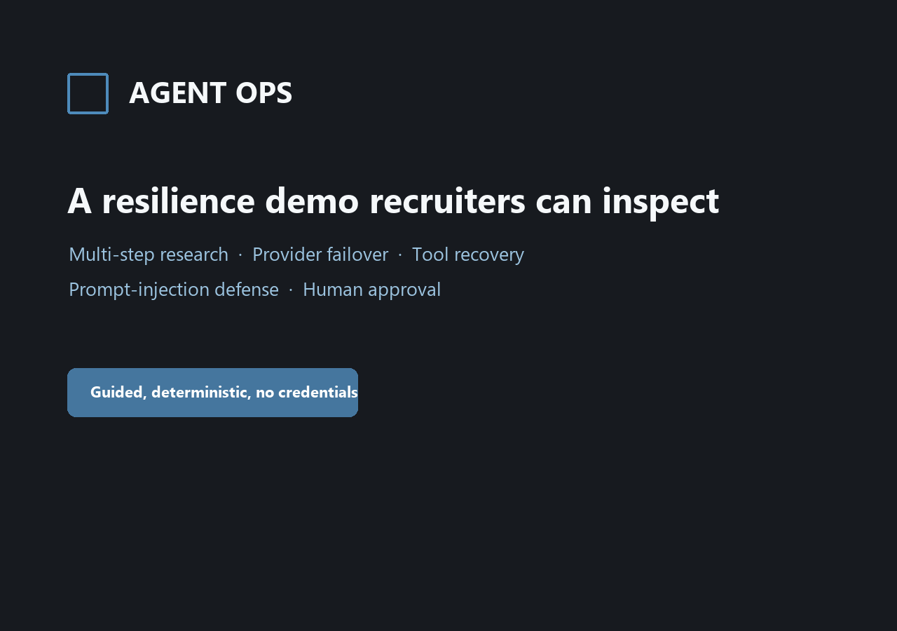

# Agent Ops

[](https://github.com/HarshTikone/agent-ops/actions/workflows/ci.yml)
[](https://agent-ops-sage.vercel.app/)
[](https://agent-ops-sage.vercel.app/demo)

> **Live demo:** [agent-ops-sage.vercel.app](https://agent-ops-sage.vercel.app/)
> — browse completed sessions and inspect their full traces without signing in.
> The free backend may take about a minute to wake up.

> **Recruiter walkthrough:** [open the no-credentials resilience demo](https://agent-ops-sage.vercel.app/demo)
> to see multi-step research, provider failover, tool-error recovery, prompt-injection
> defense, and an explicit approval boundary in one auditable trace.



A multi-agent orchestration copilot: a planner agent breaks an incoming task
into steps and delegates each to a tool-using sub-agent (web search, a
notes/document store, a calculator). Every irreversible action pauses for
human approval before it runs. Every session has persistent memory and a
full trace of what each agent decided, which tool it called, and why —
visible in the UI, not just in logs.

See [`ARCHITECTURE.md`](ARCHITECTURE.md) for how it's built and
[`ADR.md`](ADR.md) for why each stack/design choice was made (including the
LangGraph-vs-CrewAI decision and the Gemini+OpenRouter failover design).

## Stack

- **Backend:** Python, FastAPI, LangGraph
- **LLM:** Gemini (primary) with an automatic OpenRouter `:free`-model
  fallback behind one provider interface
- **Frontend:** React, TypeScript, Vite, Tailwind
- **Database:** Supabase Postgres + pgvector
- **Deploy:** Render (backend), Vercel (frontend), both auto-deploy on `main`
- **CI:** GitHub Actions (lint, type checks, tests, builds, and backend
  container smoke verification)

## Local development

### Backend

```bash
cd backend
python -m venv .venv
source .venv/Scripts/activate   # Windows Git Bash; use .venv/bin/activate on macOS/Linux
pip install -r requirements-dev.txt
cp ../.env.example ../.env      # fill in real values, see below
python -m scripts.migrate       # applies backend/migrations/*.sql — run once, and again after any schema change
uvicorn app.main:app --reload
```

`python -m scripts.archive_sessions` prints which sessions its QA/demo-fixture
heuristics would soft-archive, without changing anything; add `--apply` to
archive them for real, or `--restore-all` to undo every archive in one shot.

`python -m scripts.reap_sessions` prints which sessions look stranded — a
`running` session with no update in over 15 minutes, or a `created` session
never messaged in over a day — without changing anything; add `--apply` to
mark the stalled ones `failed` and archive the never-messaged ones for real.
It never touches `awaiting_approval` sessions.

Set an `AGENT_OPS_API_KEY` containing at least 32 bytes, then check the service with
`curl http://localhost:8000/health` and
`curl http://localhost:8000/health/ready` (the second reports which of
Gemini/OpenRouter/Supabase/DB config is missing, without ever printing a
secret value). Readiness confirms configuration and database reachability;
it does not spend provider requests or prove that configured credentials are valid.

Sessions, messages, the trace log, and the approval state machine (Day 3)
live in Postgres — `POST /sessions`, `GET /sessions`,
`GET /sessions/{id}`, `POST /sessions/{id}/messages`,
`GET /sessions/{id}/trace`, `POST /approvals/{id}/approve` /
`.../reject`. See `/docs` for the full schema, or `ADR.md` (ADR-014/015/016)
for how the approval pause survives across separate requests.

A session accepts a follow-up message once it reaches `done`, `degraded`, or
`failed` (ADR-033) — the agent keeps its prior messages and notes for that
session, so a second message can build on the first. `running` and
`awaiting_approval` still reject a second message with a 409; a session is
never mid-flight across two requests in this fully synchronous design.

Sessions can be soft-archived without deleting them: `POST
/sessions/{id}/archive` / `.../restore` set or clear `archived_at`. `GET
/sessions` excludes archived sessions by default; pass
`?include_archived=true` to see everything. An archived session still opens
directly by `GET /sessions/{id}`.

Every `POST` requires `X-Agent-Ops-Key`. The frontend asks for that key at
runtime and keeps it in `sessionStorage`; it is never a `VITE_*` value and is
not compiled into the public bundle. Read-only session, trace, liveness, and
readiness requests remain unauthenticated for demo observability.

Run checks locally exactly as CI does:

```bash
ruff check .
black --check .
pytest -v
```

### Frontend

```bash
cd frontend
npm install
cp .env.example .env   # VITE_API_URL — defaults to http://localhost:8000
npm run dev
```

```bash
npm run lint
npm run format:check
npm test
VITE_API_URL=https://api.example.invalid npm run build
```

Production builds require `VITE_API_URL`; local development falls back to
`http://localhost:8000`. See `frontend/README.md` for browser behavior and
Vercel setup.

### Backend container

The backend Dockerfile builds a non-root runtime image containing the app and
forward migrations. Its health check uses `/health` (liveness), never
dependency readiness.

### Pre-commit hooks

```bash
pip install pre-commit
pre-commit install
```

Ruff and Black run in isolated pre-commit environments. Frontend hooks use the
project's installed ESLint and Prettier and check only the changed files, so
run `npm install` in `frontend/` before installing the hooks.

## Environment variables

Copy `.env.example` to `.env` at the repo root (backend reads it) and
`frontend/.env.example` to `frontend/.env` (Vite only reads env files from
within `frontend/`). Every variable is documented inline in the `.example`
files, including which free-tier signup page to get each key from and how to
pick a current OpenRouter `:free` tool-calling model (the lineup rotates —
see `ADR-002` in `ADR.md` for the live-verification method).

**Never commit `.env`.** It's gitignored from the first commit in this repo;
double-check `git status` before pushing if you ever see it listed.

## Production deployment

`render.yaml` defines one free Docker web service and points platform health
checks at `/health`. `frontend/vercel.json` defines the Vite output and SPA
rewrite. All secrets stay in provider dashboards.

Release order:

1. From the release commit, build the backend image:
   `docker build -t agent-ops-backend:release ./backend`.
2. Before a schema-bearing deploy, run the same image explicitly against the
   production database:
   `docker run --rm --env-file .env agent-ops-backend:release python -m scripts.migrate`.
   The runner holds a PostgreSQL advisory lock, records each applied filename,
   and is safe to repeat. It is deliberately not part of API startup.
   After a deploy that adds `archived_at` (or any future soft-delete flag),
   dry-run `docker run --rm --env-file .env agent-ops-backend:release python -m
   scripts.archive_sessions`, read the printed plan, then re-run with `--apply`.
3. With the same dashboard environment, actively verify database, Supabase,
   Gemini, Tavily, and the optional OpenRouter fallback:
   `docker run --rm --env-file .env agent-ops-backend:release python -m scripts.release_check`.
   This command logs only check names and outcomes, never provider response bodies.
4. Create the Render service from `render.yaml`, fill every `sync: false`
   variable, and verify `/health` over HTTPS.
5. Import the repository into Vercel with `frontend` as the Root Directory.
   Set `VITE_API_URL` to the exact Render origin and deploy.
6. Set Render's `CORS_ORIGINS` to the exact scheme-qualified Vercel production
   origin, redeploy, then run the authenticated approval and rejection flows.

Application rollback means redeploying the previous known-good commit. Database
migrations are forward-only: never edit or reverse an applied file; ship a new
corrective migration if a schema issue is found. Current public URLs and live
walkthrough evidence are recorded in `.planning/SPRINT_03_RELEASE_CANDIDATE.md`.

## Free-tier quirks you'll hit

- **Supabase** free projects can pause after prolonged inactivity. If readiness
  reports the database unreachable, restore the project in Supabase before
  retrying the demo.
- **Render** free web services spin down after 15 minutes idle. The first
  request after a while will take 30-60 seconds to cold-start — that's
  expected, not a bug, if you're smoke-testing the live URL. The frontend
  retries idempotent reads once and shows cold-start guidance; mutations are
  never automatically retried because their server outcome may be ambiguous.
- **OpenRouter** free models cap at 20 requests/minute and 50/day per model
  with no card on file — reserved for the fallback path and its own tests,
  not routine dev-loop iteration (use Gemini for that).

## Repo layout

```
backend/            FastAPI app, agent graph, tests
backend/migrations/ SQL schema, applied by backend/scripts/migrate.py
frontend/           React + Vite + Tailwind app, tests
.github/            CI workflow, issue/PR templates
ADR.md              Architecture Decision Records — what we chose and gave up
ARCHITECTURE.md     System design: components, data flow, deployment topology
```

## Build log

This project is being built in public over 7 days as a portfolio piece. Each
day is tagged (`day-1-complete`, `day-2-complete`, ...) once its scope from
the build plan is done. `RETROSPECTIVE.md` (Day 7) has the full writeup.
